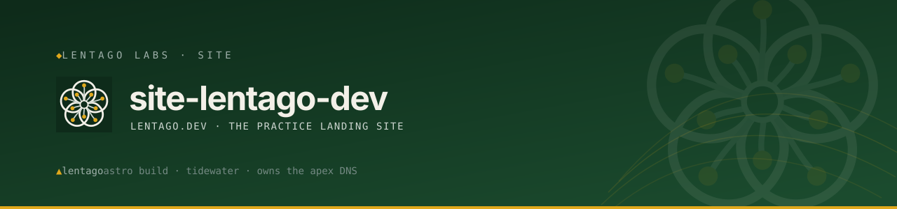

<!-- Lentago Labs brand header — generated by lentago/.github → brand/generate.py.
     Regenerate there; do not hand-edit the banner or badge URLs. -->
<a href="https://lentago.dev"></a>

[](https://github.com/lentago/site-lentago-dev/actions) [](https://github.com/lentago/site-lentago-dev/blob/main/LICENSE) [](https://deepwiki.com/lentago/site-lentago-dev)

   
# site-lentago-dev — Lentago Labs landing site

The landing site for **Lentago Labs**, live at [lentago.dev](https://lentago.dev) — an Astro static site whose merges deploy themselves: push to `main` and GitHub Actions builds the image, pushes to ECR, and rolls the ECS service via OIDC, no human deploy step and no long-lived AWS keys. All infrastructure is owned by [solidago](https://github.com/lentago/solidago).

> **Rebrand note.** Lentago Labs is the rebrand of the former **Pitzi Labs** —
> same business, same operator, same fonts and runbook voice. What changed: the
> name, the palette (navy + orange + cream → **teal + gold + limestone**), and
> the brand motif (terminal `<pl:>` command-prompt → a **five-petal blossom mark
> + survey contour lines**). The original site lives at
> [site-pitzilabs-dev](https://github.com/lentago/site-pitzilabs-dev).

**Authorship:** The code and design in this repo are co-written with
[Claude](https://claude.ai) (Anthropic). I direct the work, supply the brand and
the copy, and review the output; Claude writes the code, and the design system
was authored in [Claude Design](https://claude.ai/design). I'm an infrastructure
operator, not a software engineer or a designer — please don't read this repo as
a portfolio of either.

## 📚 Ask this codebase (DeepWiki)

<a href="https://deepwiki.com/lentago/site-lentago-dev"></a>

> [DeepWiki](https://deepwiki.com/lentago/site-lentago-dev) maintains an AI-generated wiki over this
> repository — architecture pages, diagrams, and a Q&A box grounded in the actual code. Every
> public Lentago Labs repo is indexed ([deepwiki.com/lentago](https://deepwiki.com/lentago));
> it is the fastest way to orient before reading source. It is AI-generated: trust it to orient
> you, verify against the code before you act on it.

**Good first questions:**
- What happens in the GitHub Actions pipeline between a PR merging to main and the live site at lentago.dev updating?
- Why does this repo not contain any Terraform, and where is the Route 53 / ACM infrastructure for lentago.dev actually defined?
- How does the deploy workflow authenticate to AWS, and what changed when solidago's foundry-dev-* resources were renamed to solidago-dev-*?

## 🧭 What this repo demonstrates

An Astro static site on a production deploy pipeline — simple enough to read end-to-end in an afternoon, concrete enough to carry real patterns back to your own stack.

| Pattern | How it shows up here |
|---|---|
| **OIDC deploy — no static AWS creds** | [`deploy.yml`](.github/workflows/deploy.yml) assumes `arn:aws:iam::365184644049:role/solidago-dev-github-actions` via `aws-actions/configure-aws-credentials`; no `AWS_ACCESS_KEY_ID` secret exists |
| **Apply-on-merge — merge IS the deploy** | `deploy.yml` triggers on `push: branches:[main]`; after merge, the image builds, pushes to ECR (`solidago-dev-lentago`), and the ECS service rolls — change management where the merged PR *is* the change record |
| **PR build gate separate from deploy** | [`build.yml`](.github/workflows/build.yml) runs `npm run build` on every PR; `Build` is a required status check — a broken build never reaches `main` |
| **Branch protection via API, not habit** | The `main` ruleset enforces required checks (`Build` + `docs-check`), squash-only merge, and no-force-push/no-deletion — policy-as-config rather than a convention humans can forget |
| **Fleet-shared reusable workflows** | [`docs-check.yml`](.github/workflows/docs-check.yml) and [`claude.yml`](.github/workflows/claude.yml) call `uses: lentago/shared-workflows/...@main`; one repo owns the CI logic, every consumer inherits updates |
| **Docs-link checker as a required check** | `docs-check.yml` runs on every PR and is deliberately unfiltered ([lentago/.github#57](https://github.com/lentago/.github/issues/57)) — a required check that only triggers on matching paths deadlocks every non-matching PR |
| **Generated brand assets, not hand-drifted** | The README header is a generated HTML block; re-syncing happens in `lentago/.github → brand/generate.py`, not by editing this file |
| **Automation deliberately dialed back** | [`claude-code-review.yml`](.github/workflows/claude-code-review.yml) is `workflow_dispatch` only (disabled fleet-wide 2026-06-25) — not everything defaults to "on" |

## 🛠️ Make a change yourself

This is a lab — the systems are real, the stakes are not. Pick a vector:

**Change site content and watch it ship**

Edit a component or copy under `src/` (for example the hero headline in `src/components/Hero.jsx`, or the suite section in `src/components/Suite.jsx`). Open a PR — [`build.yml`](.github/workflows/build.yml) runs `npm run build` as a required check, so a broken Astro build blocks the merge. On merge to `main`, [`deploy.yml`](.github/workflows/deploy.yml) builds the static output, packages it into the nginx container, pushes to ECR (`solidago-dev-lentago`), and force-rolls the ECS service (`solidago-dev-lentago` on `solidago-dev-cluster`), waiting for stability. No manual deploy step; no AWS console.

**Proof this works:** [#34 — Wire consult form to Formspree](https://github.com/lentago/site-lentago-dev/pull/34) · [#33 — Add social-share meta + og:image](https://github.com/lentago/site-lentago-dev/pull/33) · [#23 — Landing reorg: drop ice-cream, add Suite section](https://github.com/lentago/site-lentago-dev/pull/23)

**Fix a deploy target when the platform renames resources**

When solidago renamed all `foundry-dev-*` AWS resources to `solidago-dev-*`, this site's `deploy.yml` still pointed at the old names — the site 503'd on an empty ECR repo. The fix was a plain PR updating the `env:` block in [`deploy.yml`](.github/workflows/deploy.yml) to the new names. On merge, the corrected deploy ran and restored the live site. No AWS console access needed; the blast radius of a wrong name is one `env:` edit and a re-merge.

**Proof this works:** [#37 — fix(deploy): point at renamed solidago-dev-* resources](https://github.com/lentago/site-lentago-dev/pull/37) · [#38 — docs(deploy): update resource names](https://github.com/lentago/site-lentago-dev/pull/38)

**Adopt a fleet-wide required check**

A new required status check rolls out org-wide by editing the consuming repo's workflow file to call the reusable workflow from `lentago/shared-workflows` — no local logic to write. Merge activates the check immediately per the branch ruleset, gating every subsequent PR without additional per-repo config.

**Proof this works:** [#41 — Adopt the shared docs-check workflow](https://github.com/lentago/site-lentago-dev/pull/41)

## Why this exists

Lentago Labs needed a front door. Rather than reach for a site builder, the page
was designed as a [Claude Design](https://claude.ai/design) design system — a
one-page landing with a deliberately infrastructure-engineer aesthetic
(monospace-forward, survey/terrain feel, a teal brand with a single anther-gold
accent, anchored by the blossom mark) — and then rebuilt as a real, production
static site on the same platform the practice itself showcases. The systems the
page names are real: the site ships on `solidago`, the cloud platform listed in
its own suite section.

## What's here

| Path | Purpose |
|---|---|
| `BRAND.md` | The brand contract for the live site — mark, palette, type, conventions. Canonical token *values* live in `public/design-system/`. |
| `src/` | The Astro site (source of truth for layout + copy): `layouts/Layout.astro` (HTML shell + tokens), `pages/index.astro` (the page), `components/` (the ported sections + design-system primitives). |
| `public/design-system/` | The served design tokens (`styles.css` → `tokens/*.css`) and self-hosted fonts (Space Grotesk, JetBrains Mono). |
| `public/favicon.svg` · `public/lentago-mark-square.svg` · `public/banner.svg` | The blossom brand assets (favicon, square mark, README/og banner). |
| `Dockerfile` / `nginx.conf` | Packages the built `dist/` into an `nginx` container on port `8080` with a `/health` endpoint for the ALB. |
| `.github/workflows/deploy.yml` | Build → ECR → ECS rollout via OIDC. Runs on every push to `main`; `workflow_dispatch` kept for manual redeploys. |

## How it's built & served

```bash
npm install
npm run build      # → dist/ (static HTML + CSS, no client JS)
npm run preview    # local preview
```

The design components are **rendered server-side at build time** (no client
hydration) — the output is plain HTML plus the design-system CSS, with no React
shipped to the browser. Docker copies `dist/` into `nginx` (`:8080`, `/health`);
GitHub Actions builds the image, pushes it to ECR, and rolls the ECS service via
the solidago platform OIDC role, no long-lived credentials.

## Live at lentago.dev

The site is live at **[lentago.dev](https://lentago.dev)** (apex + `www`), served
from the shared solidago ALB. During design it was reachable only at a hidden,
unguessable subdomain of `icecreamtofightwith.com`; that preview host was retired
on promotion. The apex DNS, Route 53 zone, and ACM cert (apex + `www`, attached to
the shared HTTPS listener via SNI) are Terraform-managed in solidago via
`modules/apex-domain` (`module.lentago_domain`). The ECR repo, ECS service, and
OIDC trust for this repo are likewise provisioned there (`modules/site`); this
repo contains no Terraform.

---

🌱 **Lentago Labs** is a team learning lab — real systems, non-critical stakes, modern
operations patterns demonstrated in the open. Start at the
[org profile](https://github.com/lentago), and read this repo on
[DeepWiki](https://deepwiki.com/lentago/site-lentago-dev).
